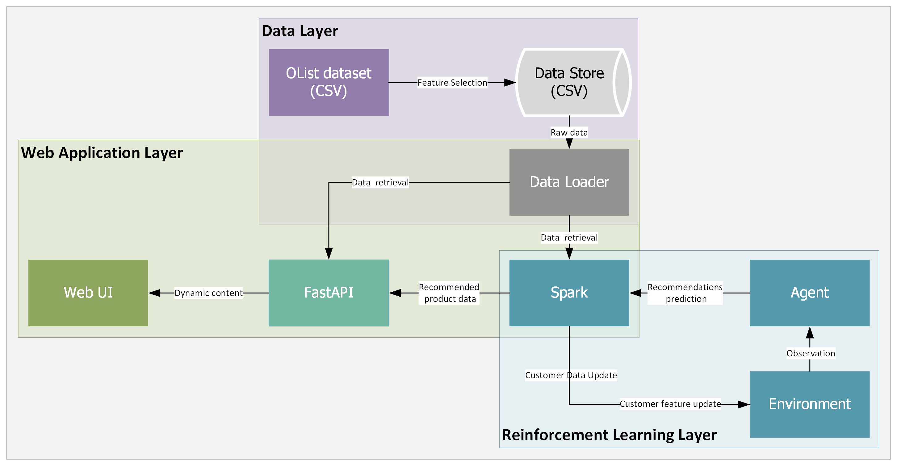
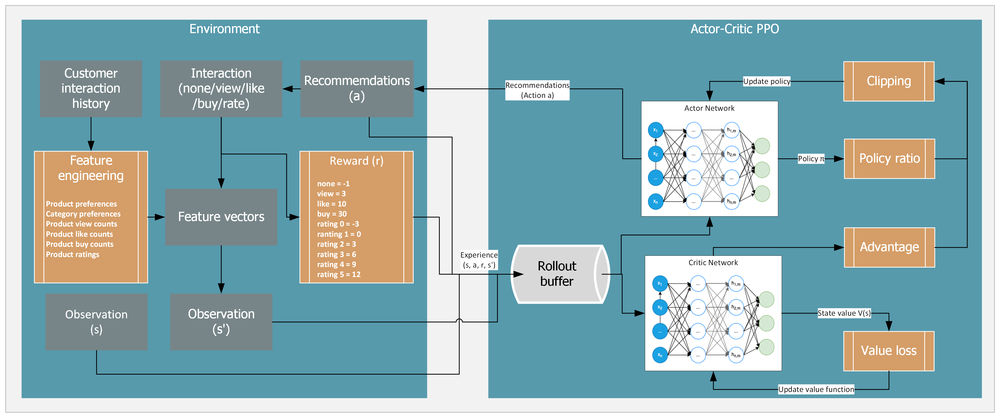
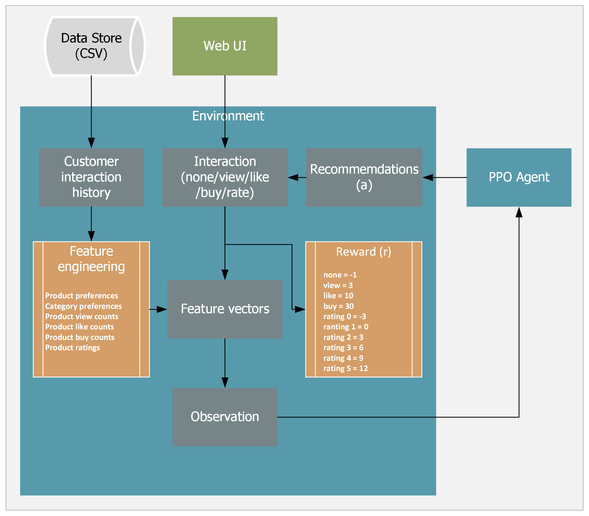
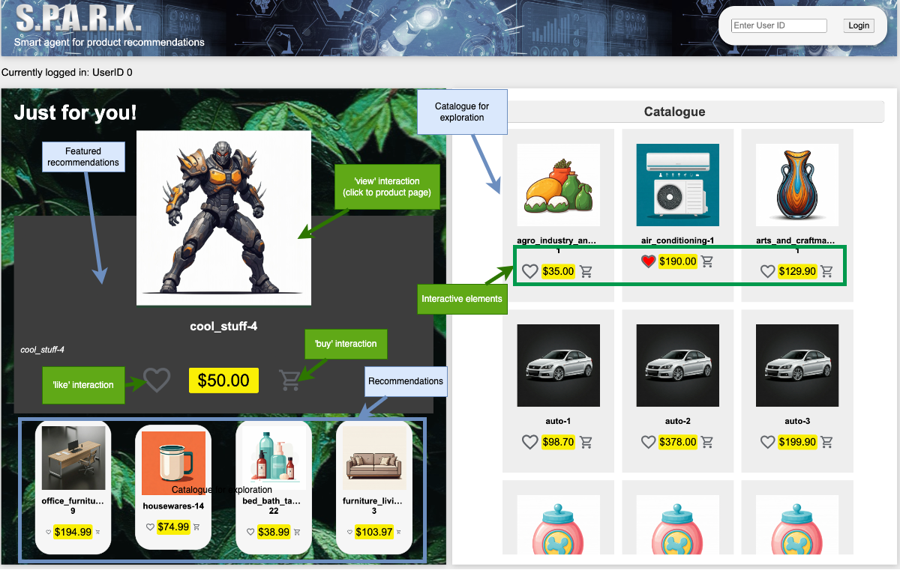
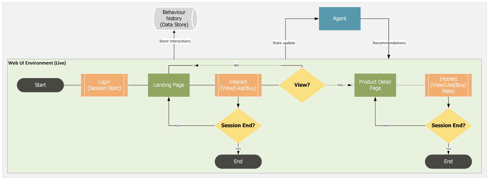

# Spark - Reinforcement Learning E-commerce Recommender System

A real-time product recommendation system powered by Proximal Policy Optimization (PPO) reinforcement learning. This project implements an interactive web application that learns user preferences through behavioral interactions and provides personalized product recommendations.

## Overview

Spark is an e-commerce recommendation engine that uses deep reinforcement learning to optimize product suggestions based on real-time user behavior. Unlike traditional collaborative filtering or content-based systems, the RL agent learns an optimal recommendation policy by maximizing long-term user engagement through interactions like views, likes, purchases, and ratings.

The system is built on the Brazilian E-Commerce Public Dataset by Olist, containing over 100,000 orders and customer interactions across multiple product categories.

### Key Features

- **Real-time RL-based Recommendations**: PPO agent provides personalized top-10 product recommendations
- **Interactive Web Interface**: FastAPI backend with dynamic frontend for user interaction tracking
- **Custom Gym Environment**: Fully implemented recommendation environment with multi-discrete action space
- **Multiple Interaction Types**: Tracks views, likes, purchases, ratings, and session behavior
- **RESTful API**: Comprehensive API for products, users, interactions, and recommendations
- **Model Persistence**: Pre-trained PPO and A2C models for deployment

## Architecture

### System Components



*Figure 1: Full system architecture showing data layer, web application layer, and reinforcement learning layer*

1. **Data Pipeline** (`data/`)
   - ETL scripts for processing Olist e-commerce dataset
   - Customer, product, and interaction data preprocessing
   - Feature engineering for RL state representation

2. **Custom RL Environment** (`app/src/spark/agent/environment.py`)
   - OpenAI Gym-compatible recommendation environment
   - Multi-dimensional observation space (product preferences, category preferences, interaction history)
   - Multi-discrete action space (top-k product recommendations)
   - Reward shaping based on interaction value (views: +3, likes: +10, purchases: +30, ratings: variable)

3. **RL Agents** (`notebooks/`)
   - **PPO (Proximal Policy Optimization)**: Primary model with 2M training timesteps
   - **A2C (Advantage Actor-Critic)**: Alternative baseline model
   - DQN experiments for comparative analysis

4. **Web Application** (`app/`)
   - **FastAPI Backend**: High-performance async API server
   - **Frontend**: Jinja2 templates with dynamic product catalog
   - **API Routes**: User management, product catalog, interactions, and recommendations



*Figure 2: Actor-Critic PPO architecture with environment interaction loop*



*Figure 3: Custom Gym environment design showing feature engineering and reward function*

### User Interface



*Figure 4: Web application landing page with RL-powered recommendations*



*Figure 5: User interaction flow and session management*

### State Representation

The observation space includes:
- **Product Preferences** (300-dim): Normalized interaction scores per product
- **Category Preferences** (71-dim): Aggregated preferences across product categories
- **Interaction Counts**: Views, likes, purchases per product
- **Rating History**: User ratings (0-5) for each product
- **Current Context**: Last interacted product and interaction type (one-hot encoded)

### Action Space

Multi-discrete action space outputting 10 product IDs for the recommendation list.

### Reward Function

```python
if interaction.type == VIEW:      reward = 3
if interaction.type == LIKE:      reward = 10
if interaction.type == BUY:       reward = 30
if interaction.type == RATE:      reward = (rating - 2) * 3
if interaction.type == NONE:      reward = -1
```

## Project Structure

```
spark/
├── app/
│   ├── main.py                    # FastAPI application entry point
│   ├── routers/
│   │   ├── api.py                 # API endpoints for data and recommendations
│   │   ├── index.py               # Homepage route
│   │   └── product.py             # Product detail routes
│   ├── src/spark/
│   │   ├── agent/
│   │   │   ├── environment.py     # Custom Gym environment
│   │   │   └── models/            # Trained RL models (PPO, A2C)
│   │   ├── data/
│   │   │   ├── loader.py          # Data loading and recommendation inference
│   │   │   ├── models.py          # Data models (Customer, Product, Interaction)
│   │   │   └── preprocessed_data/ # Cleaned CSV datasets
│   │   └── utils.py               # Helper functions
│   ├── static/                    # CSS, JS, images
│   └── templates/                 # HTML templates
├── data/
│   ├── vector_db_etl.py           # Data preprocessing scripts
│   └── cleaned/                   # Processed datasets
├── notebooks/
│   ├── Spark_PPO.ipynb            # PPO training notebook
│   ├── Spark_A2C.ipynb            # A2C training notebook
│   ├── customEnv_DQN.ipynb        # DQN experiments
│   └── logs/                      # TensorBoard training logs
├── reports/
│   └── Assignment-3-PartE-Report.pdf  # Detailed technical report
└── requirements.txt
```

## Installation

### Prerequisites

- Python 3.11
- Conda (recommended)

### Setup

1. Create and activate a conda environment:

```bash
conda create -p venv/ python==3.11
conda activate venv/
```

2. Install dependencies:

```bash
pip install -r requirements.txt
```

### Dependencies

- **FastAPI**: Web framework and API server
- **Stable-Baselines3**: RL algorithms (PPO, A2C, DQN)
- **Gymnasium**: RL environment interface
- **PyTorch**: Neural network backend
- **NumPy, Pandas**: Data processing
- **scikit-learn**: Preprocessing utilities
- **Jinja2**: HTML templating

## Usage

### Running the Web Application

Start the FastAPI server:

```bash
uvicorn app.main:app --reload
```

Access the application at `http://localhost:8000`

### API Endpoints

**Products**
- `GET /api/products` - Fetch all products
- `GET /api/product?product_id={id}` - Get product details
- `GET /api/catalogue?category_id={id}` - Get products by category

**Users**
- `GET /api/users` - Fetch all users
- `GET /api/user?user_id={id}` - Get user profile and interaction history
- `GET /api/currentUser` - Get current session user
- `POST /api/setCurrentUser` - Set current user ID

**Interactions**
- `POST /api/interaction` - Log a new user-product interaction

**Recommendations**
- `GET /api/recommendations?user_id={id}` - Get RL-generated recommendations for user

### Training New Models

Navigate to the notebooks directory and run the training notebooks:

1. **PPO Training**: `notebooks/Spark_PPO.ipynb`
2. **A2C Training**: `notebooks/Spark_A2C.ipynb`

Models are saved to `notebooks/output/spark/models/` during training.

## Model Performance

### PPO Model (Final)
- **Training Steps**: 2,000,000
- **Learning Rate**: 0.0007
- **Batch Size**: 64
- **Gamma**: 0.95
- **GAE Lambda**: 0.95
- **Clip Range**: 0.2
- **Entropy Coefficient**: 0.01

### A2C Model (Baseline)
- Alternative actor-critic approach
- Faster training with slightly lower performance

*See `reports/Assignment-3-PartE-Report.pdf` for detailed performance analysis and ablation studies.*

## Dataset

**Brazilian E-Commerce Public Dataset by Olist**
- 100,000+ orders from 2016-2018
- Multiple product categories
- Customer geolocation data
- Order reviews and ratings

### Data Preprocessing

The ETL pipeline (`data/vector_db_etl.py`) performs:
1. Dataset merging (orders, products, reviews, customers)
2. Category translation (Portuguese → English)
3. Feature extraction and encoding
4. Train/test split

Preprocessed data is stored in `app/src/spark/data/preprocessed_data/` as CSV files:
- `Customer.csv`
- `Product.csv`
- `Category.csv`
- `Interaction.csv`

## Technical Highlights

### Reinforcement Learning Approach

Traditional recommendation systems rely on historical patterns and static user profiles. This RL-based approach:
- **Learns dynamically** from sequential user interactions
- **Optimizes for long-term engagement** rather than immediate clicks
- **Adapts in real-time** to changing user preferences
- **Handles cold-start** through exploration mechanisms

### Environment Design

The custom Gym environment simulates realistic user behavior:
- **Probabilistic interaction simulation**: Users interact with recommendations based on their preference history
- **Session-based episodes**: Natural start/stop points for training
- **Reward shaping**: Balanced rewards encouraging diverse interaction types
- **State generalization**: User-agnostic features enable policy transfer across users

### Multi-Input Policy Network

The PPO policy network processes heterogeneous state features:
- Continuous preference vectors
- Discrete interaction counts
- One-hot encoded categorical features
- Combined through shared feature extractor

## Future Enhancements

- **Context-aware recommendations**: Incorporate time-of-day, seasonality, and trending products
- **Multi-objective optimization**: Balance diversity, novelty, and relevance
- **A/B testing framework**: Compare RL agent against baseline recommenders
- **Scalability**: Distributed training for larger product catalogs
- **Transformer-based policies**: Attention mechanisms for better sequence modeling

## Acknowledgments

- Dataset: [Brazilian E-Commerce Public Dataset by Olist](https://www.kaggle.com/datasets/olistbr/brazilian-ecommerce)
- Stable-Baselines3 for RL implementations
- FastAPI framework

## License

This project is for educational and portfolio purposes.

---

**Author**: [Your Name]  
**Contact**: chilliavocado@pm.me  
**Report**: See `reports/Assignment-3-PartE-Report.pdf` for comprehensive technical details
